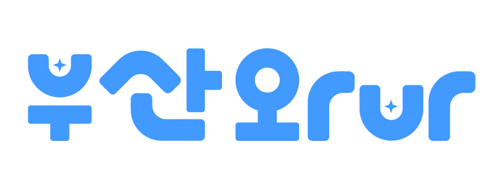

## ✈️ 부산와Vr - [간단한 설명] 

<div align=center></div>


### 🔗 부산와Vr 링크 : [Site Link](https://busanwavr.store/)
---

### 소개 영상 : [Ucc Link](https://www.youtube.com/watch?v=5GSyQMyNabU)
---

### ⏰ 개발 기간
    07.17.2023 ~ 08.17.2023


### 기획 배경
---
- 우리가 사랑하는 도시, 부산을 많은 사람들에게 알려주고 싶다.
- 부산의 다양한 여행지들을 직접 가지 않고도 실시간 VR 영상으로 즐길 수 있게 하면 어떨까?
- 부산에 관심 있는 사람들이 직접 부산을 방문한 것처럼 즐거운 경험을 가질 수 있는 서비스를 만들어보자!


### 프로젝트 개요
---
- 360도 영상 라이브 스트리밍을 통한 생생한 VR 랜선 투어 제공 서비스

- [와이어프레임](https://www.figma.com/file/7GGkxudmaNRwDje7VLlHeK/Untitled?type=design&mode=design&t=STKqHjQZDDVpGnip-1)

- [팀 메뉴트리](https://miro.com/app/board/uXjVM1wjrzs=/)

- [팀 노션 바로가기](https://molangmolang.notion.site/99b8316d1e874164b050fdfa33139c33?pvs=4)
  

### 🛠 기능 요약 
---
- #### 투어 개설
- #### 투어 검색
- #### 여행 추천 서비스
- #### 메이트 모집
- #### 360도 VR 라이브 스트리밍
- #### 실시간 채팅 & Speech-To-Text
- #### 투표 기능 & 모션 캡쳐
- #### 다국어 지원


### ✔ 주요 기술
---
**Back-end Stack**
- IntelliJ IDE
- Springboot 
- JPA
- QueryDsl
- Stomp Pub/Sub
- Spring Security
- JWT
- MailSender

**Front-End Stack**
- Visual Studio Code IDE
- React
- TailWind CSS
- TypeScript
- Redux
- antD
- WebRTC

**DB**
- Mysql
- Redis
- Mongodb

**Storage**
- amazon web S3

**CI/CD**
- AWS
- Jenkins
- Docker
- Nginx
- Https

**Other**
- OpenVidu
- Teachable Machine
- MicroSoft Azure STT
- KaKao Map

### ✔ 프로젝트 파일 구조
---
#### Back
```
BackEnd
  ├── config
  │   ├── amazonS3
  │   ├── emailConfig
  │   ├── openApi
  │   ├── queryDsl
  │   ├── redis
  │   ├── stomp
  │   └── websocket
  │
  ├── controller
  │   └── controllers...
  │
  ├── dto
  │   └── simple
  │       
  ├── document
  ├── exception
  │   ├── security
  │   └── type
  │
  ├── model
  │   └── models....
  │
  ├── service
  │   └── services....
  │
  ├── utils
  └── security
```
#### Front
```
FrontEnd
  ├── node_modules
  ├── public
  └── src
      ├── assets
      ├── components
      │   ├── atoms
      │   ├── blocks
      │   ├── common
      │   └── pages
      │       ├── Auth
      │       ├── GuideProfile
      │       ├── Home
      │       ├── LiveStream
      │       ├── Mate
      │       ├── Review
      │       ├── Root
      │       ├── Test
      │       ├── Tour
      │       └── UserProfile
      ├── hooks
      ├── navigations
      ├── store
      ├── store
      │   └── reducers
      └── utils
```

### ✔ 협업 Tool
---
- Git
- Notion
- Jira
- MatterMost
- Discord

### ✔ 협업 환경
---
- Gitlab
  - 코드의 버전을 관리
  - 이슈 발행, 해결을 위한 토론
  - MR시, 팀원이 코드리뷰를 진행하고 피드백 게시
- JIRA
  - 매주 목표량을 설정하여 Sprint 진행
  - 업무의 할당량을 정하여 Story Point를 설정하고, In-Progress -> Done 순으로 작업  
- Notion
  - 매일 작업 내용 회의록을 기록하여 보관
  - 기술확보 시, 다른 팀원들도 추후 따라할 수 있도록 보기 쉽게 작업 순서대로 정리
  - 컨벤션 정리
  - 기능명세서 등 모두가 공유해야 하는 문서 관리 
- Discord
  - 재택 작업할 경우 Team Discord 채널에서 작업
  - 작업하면서 의사소통 역량을 높이기 위해 사용
  - 페어 프로그래밍을 지향하기 위해 사용

### 👩‍💻 멤버 구성 - 이미지로 할지? 역할을 더 상세히 나눌지?
--- 
- 김남우(팀장) : Front-End
- 서정희 : Front-End
- 정은경 : Front-End
- 정영빈 : Back-End
- 황재영 : Back-End
- 김민구 : Back-End

### ✔ 아키텍처
---


### ✔ ERD
---


### ✔ 프로젝트 산출물
---
- [기능명세서](https://www.notion.so/molangmolang/4ea6840ab9ed4947b61d78355c98c993?pvs=4)
- [와이어프레임](https://www.figma.com/file/7GGkxudmaNRwDje7VLlHeK/Untitled?type=design&mode=design&t=STKqHjQZDDVpGnip-1)
- [컨벤션](https://www.notion.so/molangmolang/ea75f736858746359a519d622d66fe3f?pvs=4)
- [API](https://www.notion.so/molangmolang/API-7221bcdd11374665949d3a3c28e052d1?pvs=4)
- [회의록](https://www.notion.so/molangmolang/0ee780bdf21f400098e277a610b04b69?pvs=4)

### ✔ 프로젝트 결과물
---
- [포팅메뉴얼](./exec/TUPLI_포팅_메뉴얼.docx)
- [중간발표자료](./ppt/TUPLI_중간발표.pptx)
- [최종발표자료](./ppt/TUPLI_최종발표.pptx)
